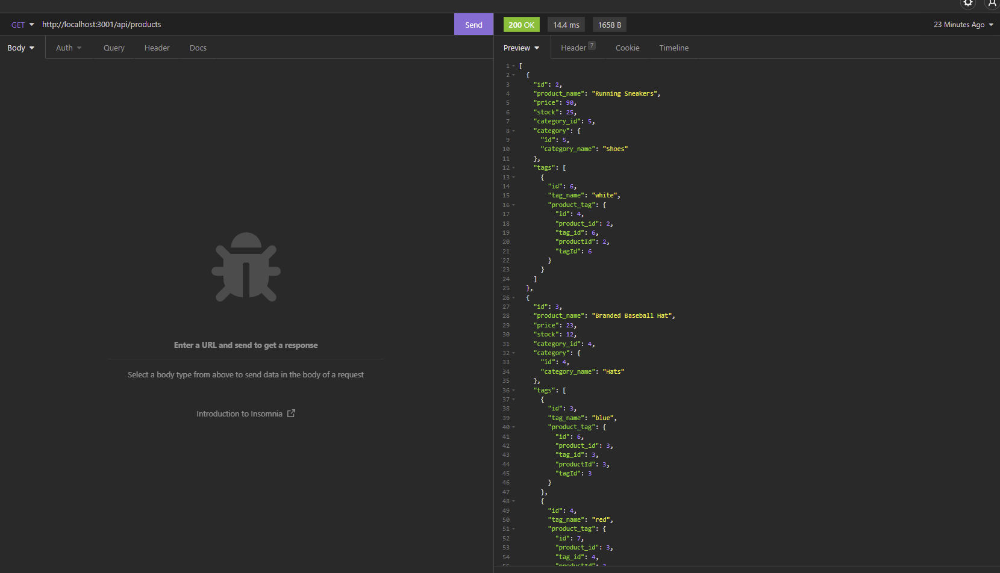
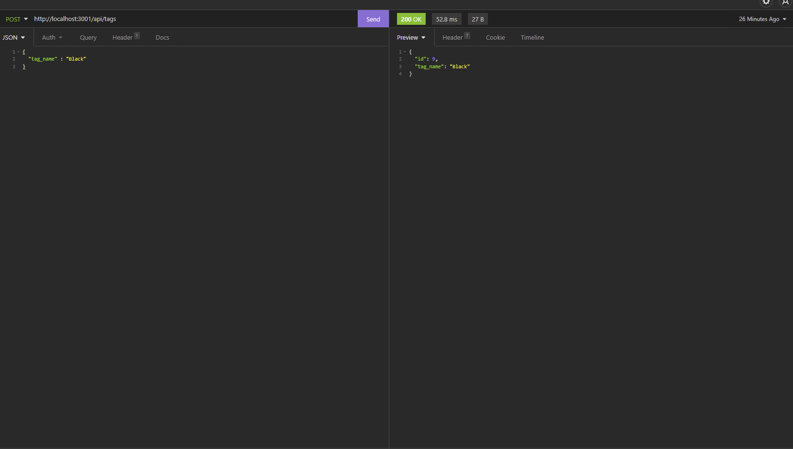
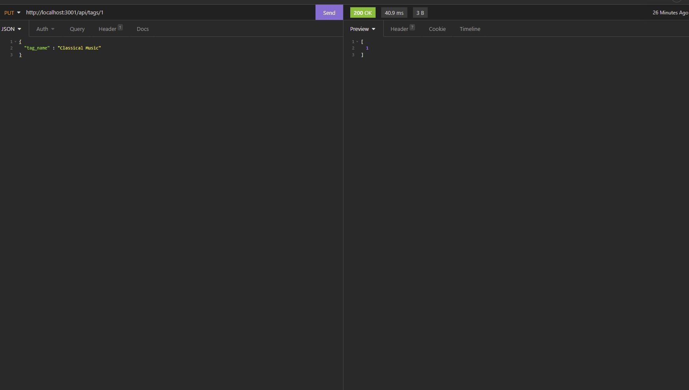
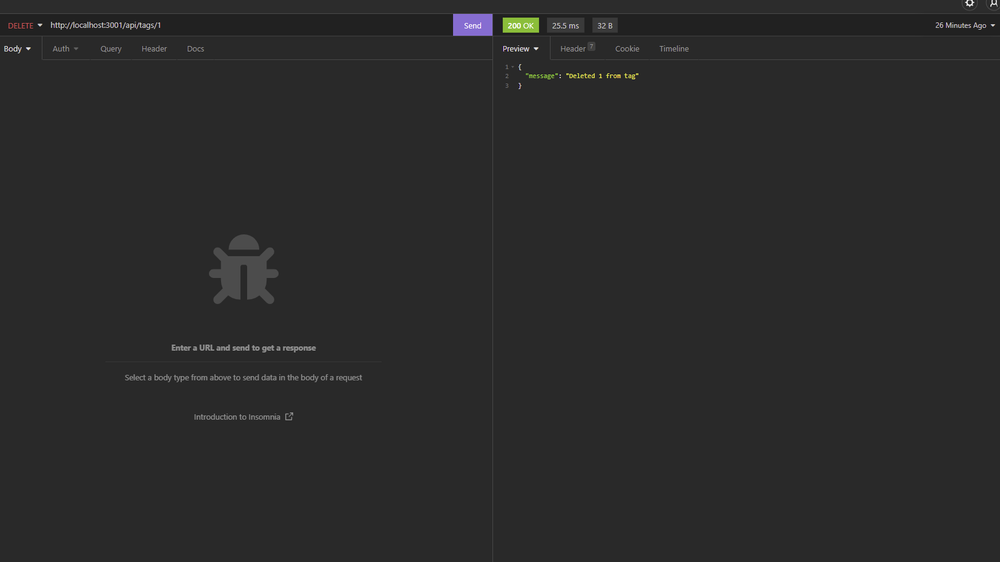

  # E-Commerce ORM

   [](https://opensource.org/licenses/MIT)

   [Video tutorial link](https://drive.google.com/file/d/19oFR-d1VhY0--9heOyAFRzHJbuvj4YLx/view)
  
  ## Table of Contents 

  * [Description](#description)

  * [Screenshot](#screenshot)
  
  * [Installation](#installation)
  
  * [Usage](#usage)
  
  * [Contributing](#contributing)

  * [License](#license)

  * [Questions](#questions)

  ## Description

  E-commerce ORM is a node express back end heavy application that works on an E-commerce backend. The code includes npm packages sequelize for the models to create the tables in mysql. mysql2 to connect to a mysql database. Express to run the intended routes efficiently.

  The testing of routes are intended for API REST calls to see how the data is supposed to create, update, delete, and select it from the tables. Only four tables are in this project that includes product, category, tag, and productTag table.

  ## Screenshot

  Here are a couple of screenshots with Insomnia REST developer tool. 

  
  Get Route: 

  

  
  Post Route: 

  

  
  Put Route: 

  

  
  Delete Route: 

  
  
  
  ## Installation 

  To install the necessary dependencies, run the following command:
  
  ```Dependencies
   npm i
  ```  
  ## Usage

  You will need to make sure you have a working database to work with. Make sure the connection to the mysql database is correct with the right database connected, username, and your passwword. You will also need to have an API client for these REST calls. I used insomnia, but you can use other API clients like Postman for this.
  
  ## Contributing

  Email me if you would like to contribute to this repo.
  
  ## License

  This project is licensed under the MIT license 

  ## Questions
  
  If you have any questions about the repo, open an issue contact me directly at [midth002@gmail.com](mailto:midth002@gmail.com). You can find more work at [midth002](https://github.com/midth002)
  
  
